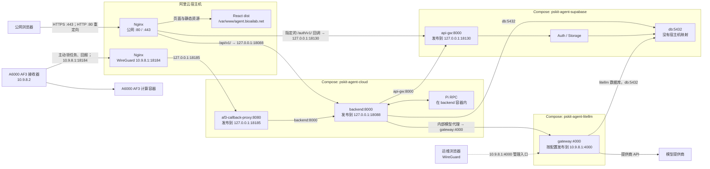
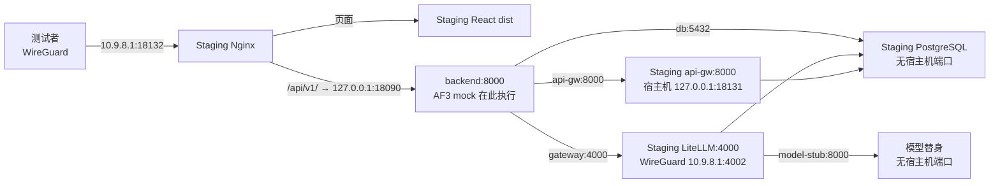

# Docker Compose 与端口：当前新版 PSKit 怎样运行

日期：2026-10-04。本文依据仓库中的 [`stack.sh`](stack.sh)、Compose 叠加文件和 Nginx 配置。它解释**配置规定的部署方式**；容器是否正在运行，应以目标主机上的 `stack.sh status` 和 `docker ps` 为准。

## 生产环境端口图



图中的虚线表示 WireGuard 运维入口；实线表示业务请求。`backend:8000`、`gateway:4000` 和 `db:5432` 是**容器网络内**的地址。不同容器可以同时使用内部端口 `8000`，因为它们各有网络命名空间。它们不是阿里云公网端口。阿里云的 `10.9.8.1` 是 WireGuard 地址；A6000 使用 `10.9.8.2`。本地浏览器预览使用的 `localhost` 端口不由这套生产 Compose 指定。

## `stack.sh` 实际启动什么

生产启动命令是 `bash deploy/agent/stack.sh up`。脚本管理三个独立的 Compose 项目，顺序如下：

| 顺序 | Compose 项目 | 读取的文件 | 长期运行的主要服务 |
| --- | --- | --- | --- |
| 1 | `pskit-agent-supabase` | `infra/supabase/docker-compose.yml` + `compose.cloud.yaml` | Supabase 网关、Auth、Storage、PostgreSQL 等 |
| 2 | `pskit-agent-litellm` | `infra/litellm/compose.shared-postgres.yaml` | LiteLLM `gateway` |
| 3 | `pskit-agent-cloud` | `deploy/agent/compose.yaml` + `compose.cloud.yaml` + `compose.postgres.yaml` | `backend`、`af3-callback-proxy` |

脚本先检查私有配置、镜像和 Compose 解析结果。它等待 Supabase 就绪，然后用第一个**临时** `docker run --rm` 检查数据库角色。接着它启动 LiteLLM，用第二个临时容器准备 `pskit` schema，最后启动 Agent。临时容器退出后不属于长期运行的服务。

这不是“一个 Compose 文件启动四个容器”。Supabase 本身包含多个容器。三个项目共享 **Supabase 项目的一个 PostgreSQL 17 容器**：PSKit 使用 `postgres` 数据库的 `pskit` schema；LiteLLM 使用独立的 `litellm` 逻辑数据库和账号。LiteLLM 项目不再启动自己的数据库容器。

Compose 从左到右合并文件。`compose.yaml` 给出基础服务；`compose.cloud.yaml` 设置云端镜像和宿主机端口；`compose.postgres.yaml` 设置最终运行模式并把 `web` 放入非默认 profile。`!override` 表示用叠加文件中的列表或映射**替换**原值，例如端口列表，不是把两套端口都保留。`build: !reset null` 让生产使用已经准备好的固定镜像，而不是启动时现场构建。

`--env-file` 给 Compose 做 `${变量}` 插值。服务内的 `env_file:` 把值传入容器。服务内 `environment:` 可覆盖同名容器环境变量。这三个位置作用不同。`stack.sh` 默认读取的私有文件列在[部署文档](DEPLOYMENT.md)中；不要把 `docker compose config` 的完整输出发到聊天或日志，因为它可能展开密钥。

## 端口写法

以 `"127.0.0.1:18088:8000"` 为例：

```text
宿主机监听地址 : 宿主机端口 : 容器端口
127.0.0.1      : 18088      : 8000
```

这里的 `127.0.0.1` 是**阿里云宿主机**的 loopback，不是用户电脑的 `127.0.0.1`。只有阿里云本机进程能直接访问这个映射。`10.9.8.1` 只在 WireGuard 接口上提供服务。没有 `ports:` 的容器仍能通过同一 Docker 网络的服务名互相访问。

## 生产端口表

| 监听位置 | 端口或映射 | 入口来源 | 实际去向与用途 |
| --- | --- | --- | --- |
| 阿里云宿主机 Nginx | `:80` | 公网 | 重定向到 HTTPS |
| 阿里云宿主机 Nginx | `:443` | 公网 | React `dist`；`/api/v1/` 转后端；仅指定的 `/auth/v1/` 回调转 Supabase |
| Docker `backend` | `127.0.0.1:18088:8000` | 阿里云 Nginx、本机诊断 | Python/FastAPI；公网 `/api/v1/` 的上游 |
| Docker `api-gw` | `127.0.0.1:18130:8000` | Python、本机 Nginx | Supabase 网关；公网仅放行 OAuth/邮箱验证相关的指定路径 |
| Docker `gateway` | `${LITELLM_BIND_IP}:4000:4000` | Docker 内网；可选 WireGuard 管理 | LiteLLM；生产配置预期绑定 `10.9.8.1`，实际地址以私有 env 为准 |
| Docker `af3-callback-proxy` | `127.0.0.1:18185:8080` | 阿里云私网 Nginx | 验证 AF3 接收器回报，再转给 `backend:8000` |
| 阿里云私网 Nginx | `10.9.8.1:18184` | 仅 A6000 `10.9.8.2` | 转发到 `127.0.0.1:18185` |
| Docker `db` | **无宿主机映射**；容器内 `5432` | 同一 Docker 网络的受权服务 | Supabase、PSKit、LiteLLM 共用 PostgreSQL 17 |
| Docker `supavisor` | **无宿主机映射** | Docker 内网 | Supabase 连接池；云端叠加文件清空其 `ports` |

阿里云 `:443` 的 `/internal/` 返回 `404`。公网 `/auth/v1/` 也不是整段开放：Nginx 只转发 `/auth/v1/authorize`、`/auth/v1/callback`、`/auth/v1/verify` 三个精确路径。前端一般通过 Python 的 `/api/v1/auth/...` 接口登录。生产 Nginx 规则见 [`host-nginx-agent-aliyun.conf`](host-nginx-agent-aliyun.conf)。

`127.0.0.1:18085:80` 仍写在云端 `web` 服务定义中，但最终叠加文件把 `web` 放进 `legacy-web` profile。`stack.sh up` 只指定 `backend af3-callback-proxy`，所以**生产不启动 `web`，也不使用 18085 提供页面**。模型替身在 `private-test` profile，同样不随生产启动。

## Docker 网络和数据卷

Agent 项目有私有 `app` 网络，以及外部的 `pskit-agent-supabase_default` 网络。`backend` 加入这两个网络。`af3-callback-proxy` 在 `app` 与 `callback_ingress` 网络上。LiteLLM `gateway` 加入 Supabase 网络。因此，容器能用 `backend`、`api-gw`、`gateway`、`db` 这些服务名通信，不需要绕行宿主机发布端口。

数据也不放在容器的临时文件系统里。Supabase PostgreSQL 使用 `pskit-agent-db-data` 卷；Storage 使用 `pskit-agent-storage` 卷；Agent 的 `/data` 卷保存 Pi 会话记录等文件。`docker compose down` 会停止服务并保留这些卷；`down -v` 会删除卷，不能用于普通重启。

A6000 的接收器使用 `network_mode: host`，没有 `ports:` 映射。它主动访问 `http://10.9.8.1:18184`。它的 journal 和 spool 挂载在 A6000 持久目录里。接收器的镜像与挂载见 [`compose.a6000-receiver.yaml`](compose.a6000-receiver.yaml)。

## Staging 端口与生产隔离

Staging 使用不同的 Compose 项目、Docker 网络、数据卷和密钥。它的模型请求进入替身；AF3 在后端使用 mock 执行器。Staging 不连接 A6000。



| Staging 入口 | 映射或转发 | 用途 |
| --- | --- | --- |
| 私网 Nginx | `10.9.8.1:18132` | 提供 Staging React `dist`；`/api/v1/` 转 `127.0.0.1:18090` |
| Staging `backend` | `127.0.0.1:18090:8000` | Staging Python API |
| Staging `api-gw` | `127.0.0.1:18131:8000` | Staging Supabase 网关 |
| Staging LiteLLM | `10.9.8.1:4002:4000` | Staging 模型网关；后接模型替身 |
| Staging PostgreSQL | 无宿主机映射；容器内 `5432` | 只保存 Staging 数据 |

Staging 的 AF3 回调代理属于 `staging-disabled` profile，不启动。Staging 前端仍由宿主机 Nginx 提供。相关文件是 [`compose.staging.yaml`](compose.staging.yaml)、[`host-nginx-agent-staging.conf`](host-nginx-agent-staging.conf)和[`staging.sh`](staging.sh)。

## 本地开发与生产的区别

本机联调会额外叠加 [`compose.local.yaml`](compose.local.yaml)。它可以启动 `web` 容器，并把 `127.0.0.1:18085`、`127.0.0.1:18088`、`127.0.0.1:18185` 映射到本机。这里的 `127.0.0.1` 才是运行本机 Docker 的那台机器。本地联调与阿里云生产使用不同配置；不要把两个环境中的同号端口当作同一个进程。

## 怎样核对正在运行的端口

在**阿里云**运行以下只读命令。它们显示当前容器与宿主机监听状态，不打印私有 env：

```bash
bash deploy/agent/stack.sh status
docker ps --format 'table {{.Names}}\t{{.Ports}}'
ss -lnt
```

读 `docker ps` 时，先找 `127.0.0.1:18088->8000/tcp`、`127.0.0.1:18130->8000/tcp` 和 `127.0.0.1:18185->8080/tcp`。再看 LiteLLM 的绑定地址。`ss -lnt` 应能看到 Nginx 的 `:80`、`:443` 和私网 `10.9.8.1:18184`。若某个映射与本表不同，以**目标主机实际运行的 Compose 配置与监听结果**为准，再查对应项目的文件叠加和私有 env；不要只看基础 `compose.yaml`。
