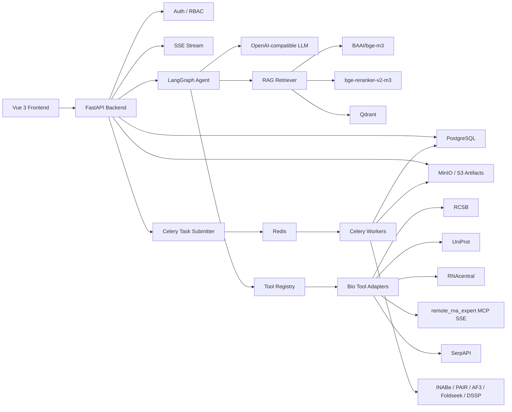

# System Architecture

## High-Level Architecture



## Service Boundaries

### Frontend

The frontend is responsible for:

- Login/register pages.
- Agent workspace.
- Session history.
- Tool call cards.
- Artifact cards.
- Task status panel.
- RAG source chips.
- Doctor/admin page.
- Molecule viewer integration.
- Technical documentation pages.

### API Backend

The FastAPI backend is responsible for:

- Auth and sessions.
- RBAC and ownership checks.
- Agent streaming endpoint.
- Task creation and status APIs.
- File registration and download.
- Runtime doctor.
- RAG index admin APIs.
- Tool adapter invocation.

### Agent Runtime

LangGraph is responsible for:

- Session state loading.
- RAG retrieval.
- Skill selection.
- Preflight checks.
- LLM calls.
- Tool call routing.
- Structured error diagnosis.
- Final answer generation.
- Event streaming to frontend.

### Worker Runtime

Celery workers run:

- AlphaFold 3 jobs.
- INABe predictions.
- PAIR predictions.
- Feature extraction.
- Report generation.
- RAG index rebuild.

## Data Ownership Rule

Every user-generated object must be tied to `user_id`:

- Agent session.
- Agent message.
- Task.
- Artifact file.
- Report.
- Uploaded file.

Frontend state is not a security boundary. The backend database is the source of truth.

## Deployment Shape On A6000

```text
A6000
  FastAPI app
  Celery worker
  PostgreSQL
  Redis
  Qdrant
  MinIO
  Caddy or Nginx
  model weights under /data1/kxchen/pskit-data/model_parameters
  AF3 db under /home/public/database/alphafold3
```

