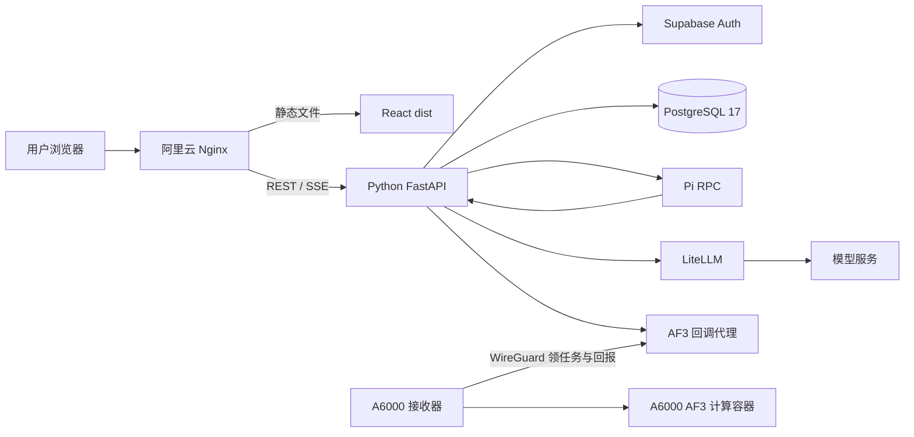

# 新版 PSKit Agent 架构

日期：2026-10-04。依据：本仓库的代码与部署配置。

## 写法

[Karpathy 的建议](https://x.com/karpathy/status/2105819303471976479)是让模型借鉴 ASD-STE100，使解释更容易读。本文件把这个思想用于**架构说明**：固定名称，短句，一段只说明一个职责。这里没有给 Agent 增加写作功能。ASD-STE100 是英语技术文档标准；中文文件不能声称符合该标准。见 [ASD 官方 FAQ](https://www.asd-ste100.org/STE_faq.html)和[资料核对笔记](research/2026-10-04-asd-ste100-agent-primary-sources.md)。

## 系统边界

阿里云运行前端、API、Agent、认证、数据库和模型网关。A6000 运行 AF3 接收器和计算容器。浏览器不直接连接数据库、Pi、模型提供商或 A6000。前端打包为 `dist`，由 Nginx 提供；前端没有常驻容器。

## 固定术语

| 名称 | 含义 | 谁保存它 |
| --- | --- | --- |
| Project | 一组对话的工作范围 | Python/PostgreSQL |
| Session | 一段对话 | Python/PostgreSQL；Pi 保存会话记录文件 |
| Run | 一次 Agent 执行，包含状态、事件和额度记录 | Python/PostgreSQL |
| Skill | 领域说明及允许使用的工具 | Python 读取版本化文件并核对许可 |
| Job | 一次 AF3 后台计算 | Python/PostgreSQL；接收器保存待确认结果 |
| Artifact | Job 或工具产生的用户文件 | Python 保存内容与归属 |

## 组件职责

| 组件 | 职责 | 代码入口 |
| --- | --- | --- |
| React SPA | 选择项目、会话、模型和上下文；显示消息、进度和文件 | [`new_frontend/src`](../new_frontend/src) |
| Nginx | 提供 `dist` 和 HTTPS；把 `/api/v1/` 转发给 Python；拒绝公网 `/internal/` | [`host-nginx-agent-aliyun.conf`](../deploy/agent/host-nginx-agent-aliyun.conf) |
| FastAPI | 校验身份与归属；创建 Run；保存事件；管理 Token、GPU、文件和 AF3 Job | [`main.py`](../new_backend/app/main.py) |
| Pi RPC | 调用模型；按当前 Run 的许可调用工具；保存同一 Session 的上下文 | [`pi_rpc.py`](../new_backend/app/adapters/live/pi_rpc.py)、[`extension.js`](../new_backend/pi/extension.js) |
| Supabase | 邮箱身份、令牌和 Storage 服务 | [`supabase_auth.py`](../new_backend/app/adapters/live/supabase_auth.py) |
| PostgreSQL | 保存 Supabase 数据、`pskit` 业务 schema 和 LiteLLM 逻辑数据库 | [`compose.postgres.yaml`](../deploy/agent/compose.postgres.yaml) |
| LiteLLM | 保存模型部署与提供商密钥；向后端提供模型别名 | [`compose.shared-postgres.yaml`](../infra/litellm/compose.shared-postgres.yaml) |
| A6000 接收器 | 主动领 AF3 Job；回报进度、产物和完成状态 | [`compose.a6000-receiver.yaml`](../deploy/agent/compose.a6000-receiver.yaml) |

Python 是业务状态的来源。Pi 决定下一步调用什么工具。模型网关决定模型请求发往哪里。AF3 接收器决定在哪里执行计算。这四个职责分开。

## 一次普通对话

1. 浏览器向 Python 发送消息，以及模型、Skill 和附件 ID。
2. Python 检查 Session 归属。Python 再次解析所有 ID，并检查工具许可和 Token 额度。
3. Python 保存用户消息，创建 Run，并调用 Pi RPC。
4. Pi 通过 Python 的内部模型代理访问 LiteLLM。Pi 只使用当前 Run 允许的工具。
5. Python 保存文本增量、工具状态和 Run 状态。浏览器从 `/api/v1/runs/{run_id}/events` 读取 SSE。断线后，浏览器用事件游标继续读取。
6. Python 保存最终消息。浏览器通过 REST 读取持久快照。

相关接口见 [`workspace.py`](../new_backend/app/api/workspace.py)和[`runs.py`](../new_backend/app/api/runs.py)。SSE 事件名和 JSON 字段是机器协议。文档的写作风格不改变协议。

## 一次 AF3 长任务

1. Pi 调用 `submit_af3`。Python 检查审批、用户 GPU 额度和工具许可。
2. Python 保存 Job。Pi 停止本轮推理。Run 保持等待状态。
3. A6000 接收器经 WireGuard 主动领 Job。接收器把进度与结果发回阿里云私网入口。
4. Python 保存产物和实际状态。只有完成回报写入后，系统才确认 Job 完成。
5. Python 在原 Session 自动唤醒 Pi。Pi 读取服务端结果并继续回答。

提交 Job 不代表计算成功。模型不能把模拟结果说成真实 AF3 结果。接收器的 journal 和 spool 保存未确认回报；只有服务端确认后，接收器才能清理对应记录。代码入口见 [`internal.py`](../new_backend/app/api/internal.py)和[`agent.py`](../new_backend/app/services/agent.py)。

## 数据与权限

- Python 使用受限 `pskit_app` 账号访问 PostgreSQL 的 `pskit` schema。LiteLLM 使用独立账号和逻辑数据库。Supabase Auth 与 Storage 使用同一 PostgreSQL 容器，但业务权限分开。
- Pi 会话记录在 Agent 数据卷。Supabase Storage 与数据库使用自己的持久卷。AF3 接收器在 A6000 保存 journal 和 spool。
- 前端不保存提供商 key、Supabase service key 或 AF3 回调密钥。私有配置留在服务器的 `0600` 文件中。
- 用户上传文件、MCP 返回和模型输出是数据。它们不能修改系统指令、工具许可或额度。
- 公网 Nginx 拒绝 `/internal/`。AF3 私网入口只接受 A6000 的 WireGuard 地址，并校验回调密钥。

## 当前启用范围

生产叠加配置启用 Pi 和 AF3 回调模式。它关闭匿名登录与远端 MCP 执行。会员 GPU 日额度配置为 `0`；管理员需明确授予测试额度，才能执行真实 AF3。用户专属 Pi 沙箱有[可选部署方式](../deploy/agent/SANDBOX.md)，默认生产启动命令没有启用它。当前公网入口、后端和只读 AF3 回调链路已有运行记录；登录后的完整交互与真实 AF3 Job 仍需按[部署文档](../deploy/agent/DEPLOYMENT.md)验收。不要把配置存在当成运行结果。

## 代码地图

| 目录 | 内容 |
| --- | --- |
| `new_frontend/` | React、Vite、TypeScript 前端 |
| `new_backend/app/api/` | HTTP 与 SSE 接口 |
| `new_backend/app/services/` | Agent 执行和模型目录 |
| `new_backend/app/domain/` | 会话、任务、配额、目录规则 |
| `new_backend/app/adapters/` | Supabase、Pi、MCP 与替身适配器 |
| `new_backend/pi/` | Pi 扩展、系统提示和固定依赖 |
| `new_backend/skills/` | Skill 清单与说明 |
| `infra/supabase/`、`infra/litellm/` | 认证、数据库与模型网关配置 |
| `deploy/agent/` | Compose、Nginx 与运维脚本 |
