# Skill 工作空间与 MCP 交互设计稿

日期：2026-10-05。**仅为设计预览，未接入正式页面。** 文件和示例目录用于讨论布局，不能作为已接通科研服务、已创建用户账号或已迁移 Skill 的证据。

## 打开可点击稿

当前本机预览：[http://127.0.0.1:5196/](http://127.0.0.1:5196/)。静态源文件：[index.html](index.html)。不连接后端、不发出模型请求，状态仅保存在当前页面内存中。

之后重新打开：

```bash
cd /home/jhli/pskit-2.0
python3 -m http.server 5196 --bind 127.0.0.1 \
  --directory docs/design/2026-10-05-skills-workspace
```

可以查看：

1. 在目录中搜索“同源”，打开卡片，切换左侧文件，点右上斜铅笔编辑个人副本。
2. 侧栏点“新对话”，在输入框左下角打开 Skills，勾选、查找或恢复默认。
3. 点规划右上角“产物”，查看对应文件列表。
4. 点账号旁设置，查看默认 Skills、工作空间暂停 / 恢复、用量及常规设置。
5. 右上角切换浅色 / 深色；缩窄窗口查看移动布局。
6. 侧栏点 MCP，搜索 / 过滤平台或个人连接，切换启用，打开详情并调整工具范围。
7. 点“添加连接”，用虚构名称、HTTPS 地址及虚构 Token 预览检查 / 工具勾选 / 保存；本稿不发送网络请求、不存真实密钥。
8. 点“内网接入指南”查看四步面板，或打开[完整指南 HTML](mcp-guide.html)。

本稿中文为主，用量与文件树是示例，不进行注册和授权模拟。真实个人编辑、持久选择、容器生命周期和中英语言切换在[产品设计](../../superpowers/specs/2026-10-05-user-skills-workspace-ui-design.md)中定义，待后续实施。

MCP 直达：[http://127.0.0.1:5196/#mcp](http://127.0.0.1:5196/#mcp)。平台 / 个人服务行均为合成布局数据，不代表线上已经发布对应服务；表单的“测试连接”只展示下一步示例。完整指南 HTML 由[指南 Markdown](../../guides/user-mcp-ngrok.md)生成供静态预览，正式内容与协议边界以 Markdown 和规格为准。

## 桌面设计

### 紧凑卡片与搜索

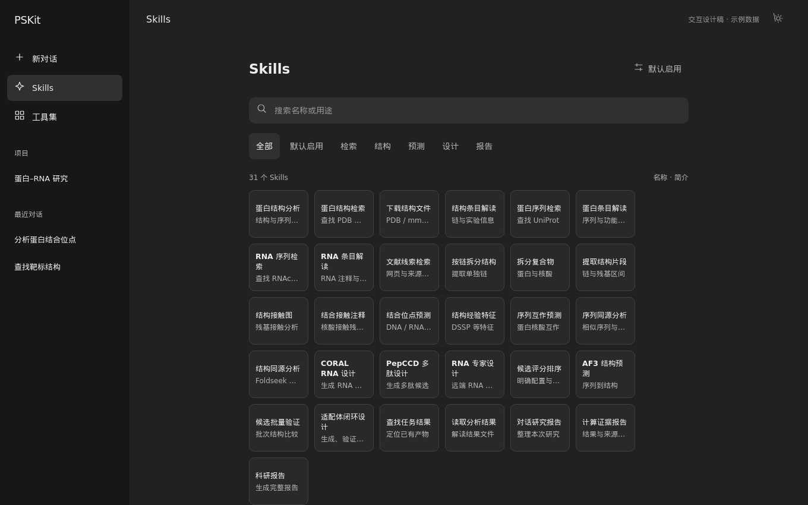

### 目录 / 文件 / 铅笔编辑

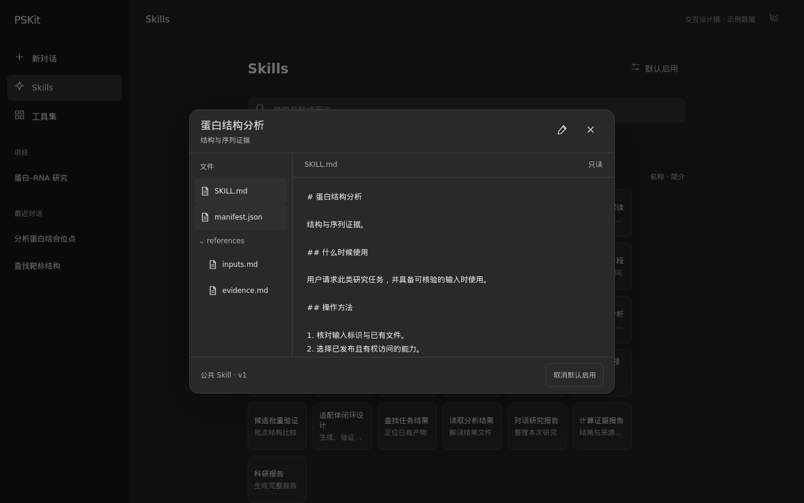

### 会话左下角选择

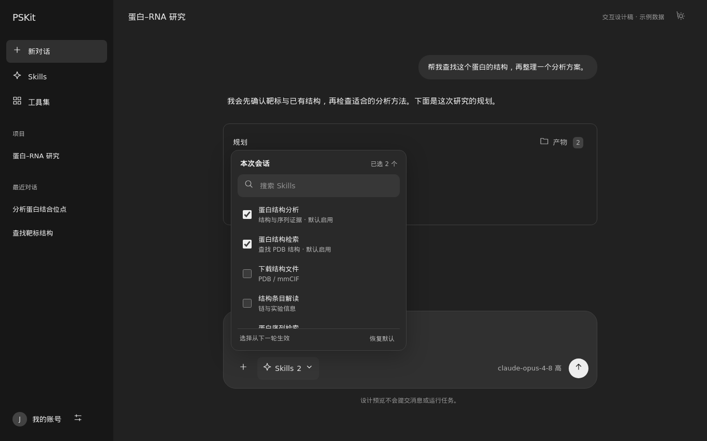

### 规划右上角产物

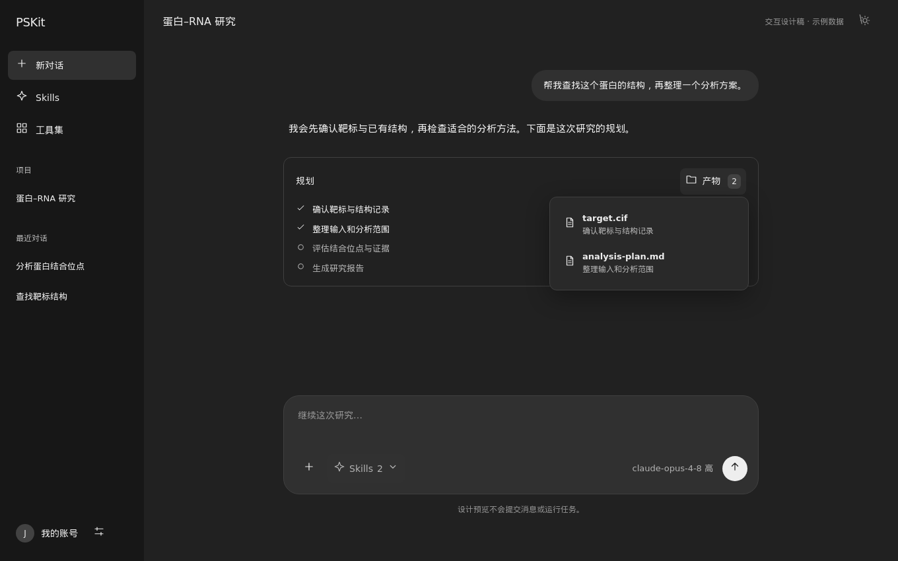

### 默认 Skills 设置

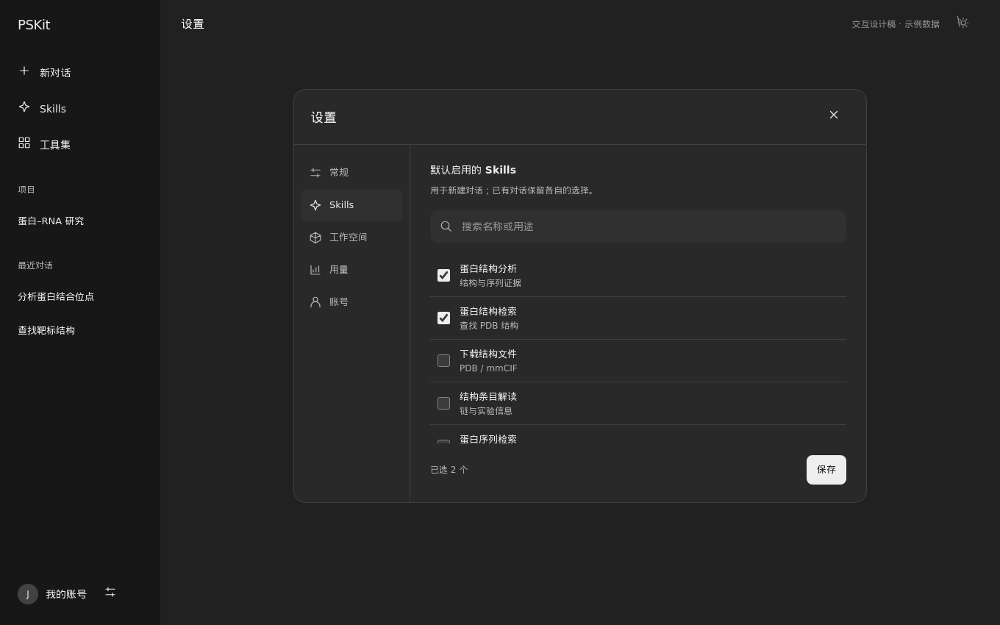

### 暂停并保留工作空间

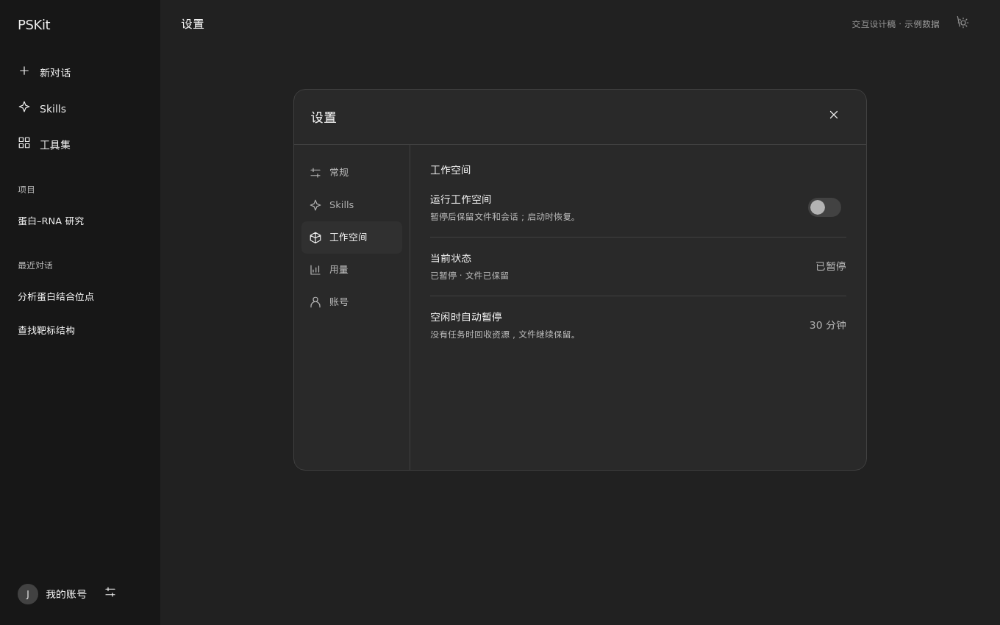

### 浅色常规设置

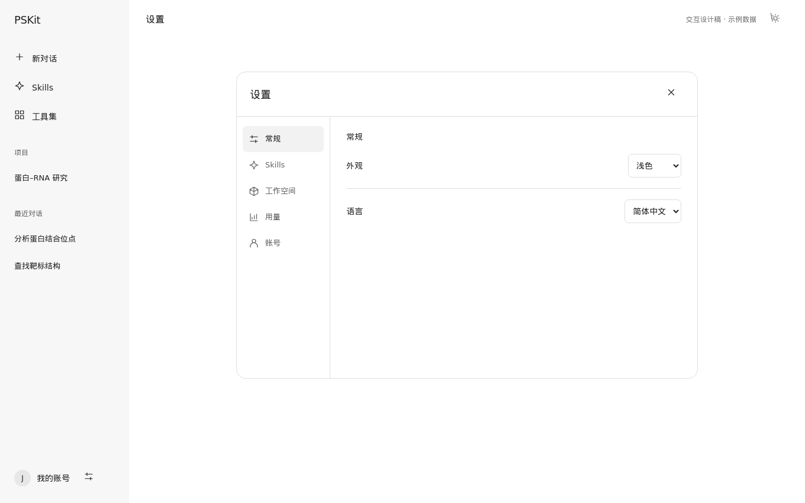

### MCP 连接列表

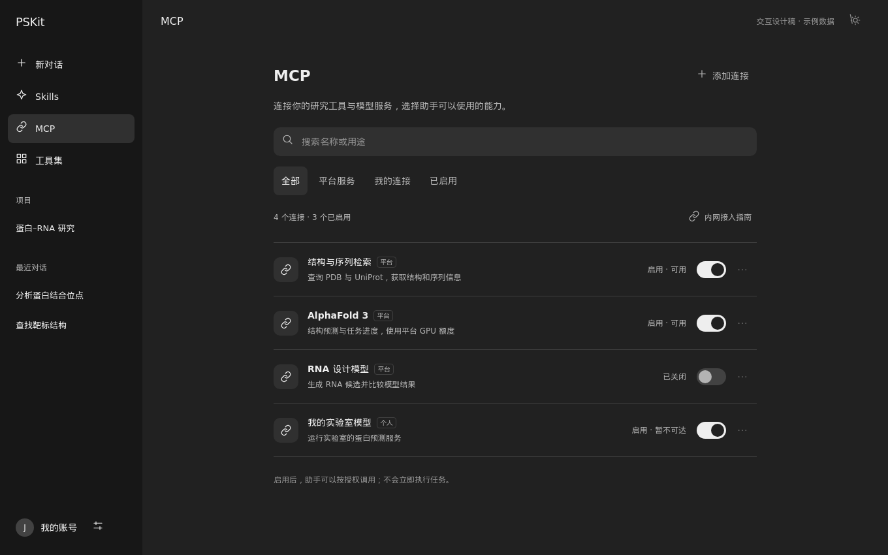

### 添加连接与选择授权工具

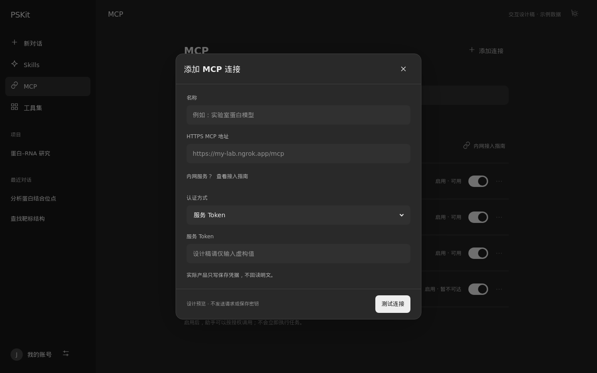

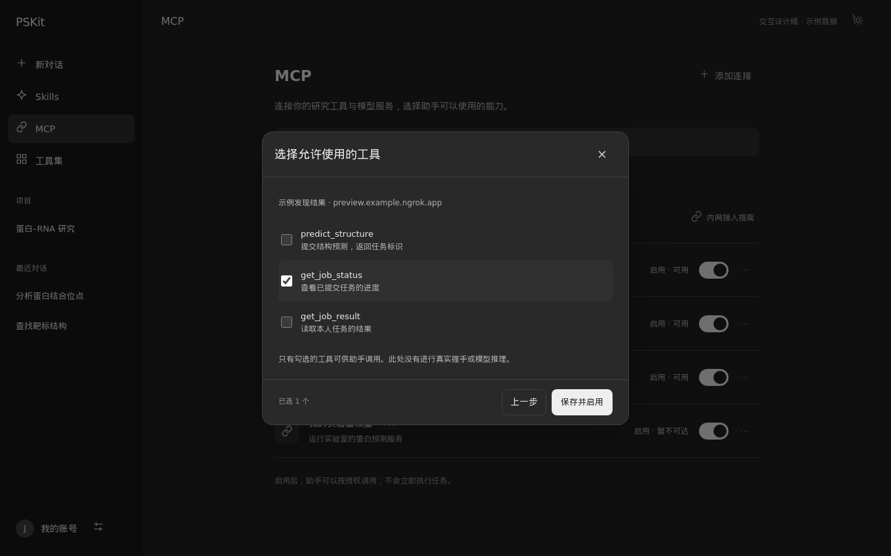

### 连接详情与内网指南

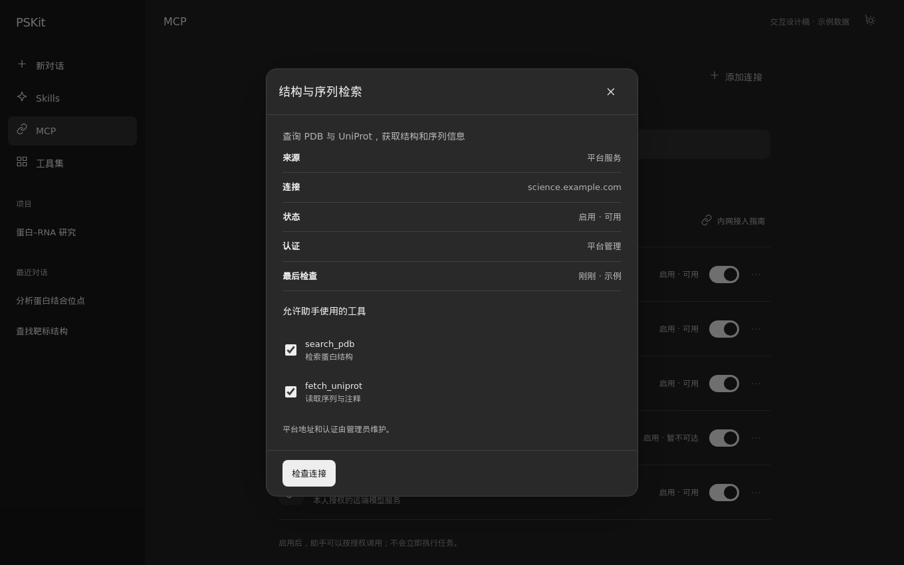

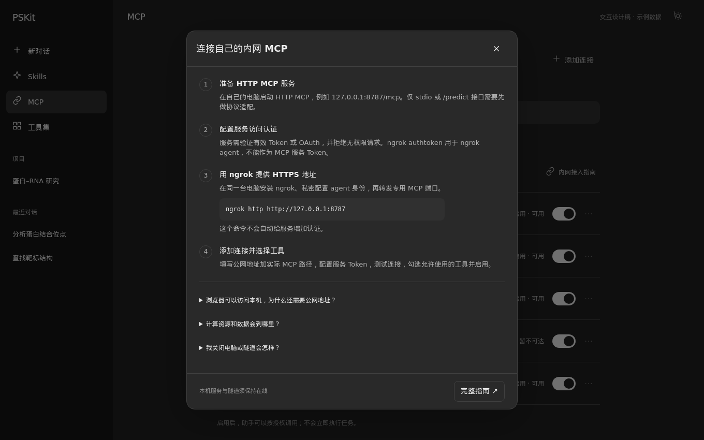

### 浅色 MCP 页面

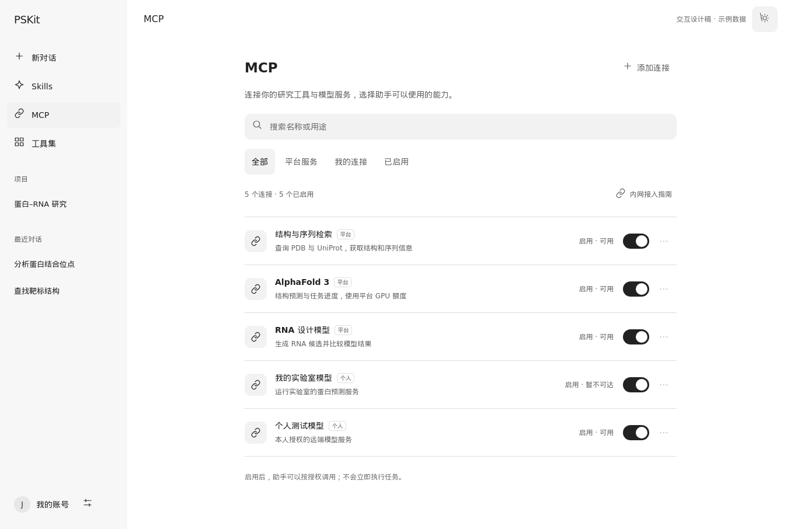

## 手机设计

- [目录](skills-mobile.png)
- [详情](skill-detail-mobile.png)
- [会话选择](conversation-mobile.png)
- [设置](settings-mobile.png)
- [MCP 列表](mcp-mobile.png)
- [添加 MCP](mcp-add-mobile.png)
- [内网指南面板](mcp-guide-mobile.png)
- [完整内网指南](mcp-full-guide-mobile.png)

## 设计预览检查

本机已有 Chromium 在 1360 × 850 / 390 × 844 下实际渲染；检查搜索、切换文件、取消草稿、复选框、主题及暂停状态。卡片测得 100 × 80 px，手机页面宽度没有横向溢出。结果见 [preview-inspection.json](preview-inspection.json)。这是静态稿布局检查，不是正式功能、API 或容器验收。

初次预览发现 hash 切换未更新页面，以及手机文件面板需要限制内部高度；已修正后重新检查。未新增 / 运行正式应用测试，未部署云端，未消耗付费模型或 GPU。

MCP 补充检查见 [mcp-preview-inspection.json](mcp-preview-inspection.json)：同样在 1360 × 850 / 390 × 844 实际渲染，搜索、来源过滤、开关、虚构添加、默认不全选工具、详情、指南及 Escape 返回正常；浅深主题无页面横向溢出，指南全文本机 HTTP 200，未发现脚本异常。手机列表显示连接状态，避免只在桌面可见。既有 Skill 卡片仍为 100 × 80 px；所有检查仅针对设计预览。

## 来源与正式规格

- [产品设计规格](../../superpowers/specs/2026-10-05-user-skills-workspace-ui-design.md)
- [逐项旧能力映射](../../research/2026-10-05-legacy-skill-inventory.md)
- [LiteLLM / MLflow / Pi 官方研究](../../research/2026-10-05-skill-registry-tracing-research.md)
- [MCP 连接补充规格](../../superpowers/specs/2026-10-05-user-mcp-connections-design.md)
- [浏览器 / 内网 / ngrok 官方研究](../../research/2026-10-05-user-mcp-connectivity-research.md)
- [完整内网接入指南](../../guides/user-mcp-ngrok.md)
