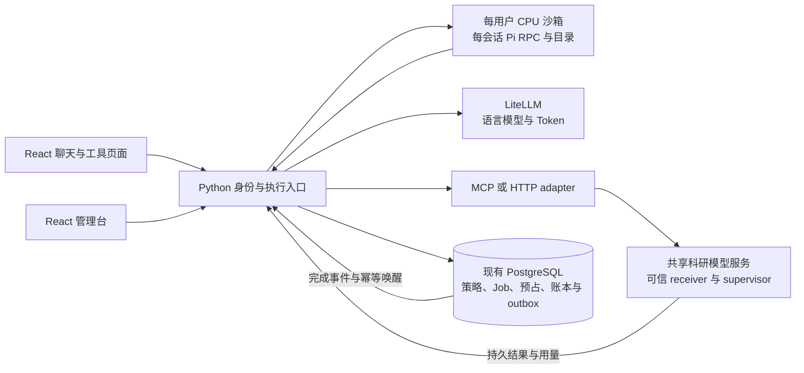

# 用户沙箱、科研模型 MCP 与管理台：统一对接方案

调研日期：2026-10-04。本文是供项目负责人和模型服务维护者审阅的**接口草案**，不是已部署能力清单。此次只阅读源码、核对官方资料并编写文档，没有实现 SDK、修改服务配置、创建容器、调用模型或执行实施测试。

## 1. 前端收尾与本次范围

前端已有两组提交：`10f90bd` 将推理等级改成向上推杆、去除模型搜索框白色边框；`1b00eee` 将主加载图标固定到助手回复左上角，覆盖首个事件之前的等待。发布记录分别在 [推杆发布记录](/home/jhli/pskit-2.0/deploy/agent/releases/2026-10-04-thinking-lever.md)与 [流式回复发布记录](/home/jhli/pskit-2.0/deploy/agent/releases/2026-10-04-reply-loading.md)。此前的测试、浏览器验收和云端制品核对在记录中保留，本次未重新运行这些测试。

用户对容器的描述同时包含“每个用户一个容器”和“一个容器多个用户多个会话复用”。本文暂按**每用户独立执行边界、同用户多个会话复用**提出建议，这一归属仍待确认。不同用户共享一个容器应被视为另一种“课题组共同信任的租户”方案，不能仅用多个目录当作用户隔离。

本次要交接三件事：

1. 沙箱 provider 与现有 Pi/会话系统的连接边界。
2. 同门模型服务的注册、执行、计量、额度和结果回传契约。
3. 管理台应读取和修改哪些业务对象，以及现有 API 的缺口。

详细核对记录：[沙箱选型](/home/jhli/pskit-2.0/docs/research/2026-10-04-user-sandbox-options.md)、[MCP 与计算计量](/home/jhli/pskit-2.0/docs/research/2026-10-04-science-mcp-metering.md)、[管理台](/home/jhli/pskit-2.0/docs/research/2026-10-04-agent-admin-console.md)。

## 2. 推荐的整体连接方式



这里的用户沙箱主要运行 Pi、文件与 CPU 工具；同门 GPU 模型服务位于独立执行域，保留各自依赖、权重和常驻模型。阿里云承载前端、Python 与既有身份/网关，A6000 承载 GPU 模型服务。双方仍可沿用 WireGuard 和主动领任务模式，无需为了本次需求增加大型 MQ。

三个稳定边界：

| 边界 | 负责什么 | 不应取得的权限 |
| --- | --- | --- |
| 沙箱 provider | 环境启停、进程、文件、CPU/RAM/PIDs 运行限制、资源观测 | 用户配额管理员、数据库、Docker 任意控制与真实模型 key |
| Python 控制面 | Supabase 身份、当前授权、任务、配额预占/结算、发布策略、持久事件、Pi 唤醒 | 不承担每种模型内部的推理实现 |
| 模型服务/受信任 executor | 输入执行、实际资源控制、取消确认、可信计量、产物与回传 journal | 不根据用户提交的 `user_id` 自行授权、不持跨用户数据库权限 |

MCP/HTTP 是传输和工具协议，Job 是执行实例，Skill 是给 Pi 的领域指导。不要为每个新模型复制一套 AF3 队列、额度与唤醒代码，也不要让 Skill 实现计费。

## 3. 沙箱：长期保留用户存储，按需运行容器

建议一个用户持有稳定的 `sandbox_owner_id` 和独占持久卷；容器是可以停止、重建和换镜像的运行实例。每个活跃会话独立 Pi RPC 子进程、transcript、cwd。同用户会话可以共享容器和主动共享的缓存，不能共享一个有状态 Pi conversation。

```text
用户持久卷 /workspace/
├── shared/                        显式共享的用户文件与缓存
└── sessions/<session_id>/
    ├── files/                     本会话授权文件
    ├── artifacts/                 本会话输出
    ├── attempts/<attempt_id>/      执行临时目录
    └── .pi/                       持久 transcript
```

等待远程模型时，先持久化 Run/Job 关联，再退出 Pi；无其他活动即可停止用户容器。模型完成后重新启动同一用户环境，恢复对应会话，不依赖旧 PID 或内存快照。Docker `pause` 主要冻结进程，不能作为释放 RAM 的方案；停止和删卷必须是不同操作。[Docker pause](https://docs.docker.com/reference/cli/docker/container/pause/)、[持久卷](https://docs.docker.com/engine/storage/volumes/)

### 现成方案选择

| 选择 | 对接建议 |
| --- | --- |
| 现有 Docker manager | 受信课题组、受限工具的最小路径；补活动 lease、文件往返、磁盘与出口限制 |
| **OpenSandbox** | 最匹配的现成自建 SDK 候选：Python SDK、文件/执行/生命周期 API，先评估 Docker 模式；作为现有 provider 的替换实现 |
| **gVisor** | 向公网开放任意 shell/Python 时，作为 CPU 执行隔离运行时候选；需验证 Node/Pi/Python 兼容性 |
| E2B / Kata | microVM 或虚拟机边界候选；托管、完整自建和主机虚拟化条件另行评估，当前无需直接引入 |

OpenSandbox 官方支持从 Docker 到 Kubernetes 的统一 API；这使它值得作为 provider 候选，但不会自动解决 PSKit 用户额度或科研结果结算。[OpenSandbox](https://github.com/opensandbox-group/OpenSandbox) gVisor 增加与宿主内核之间的隔离层，生命周期仍需 provider 管理。[gVisor 架构](https://gvisor.dev/docs/architecture_guide/intro/)

对接时只保留一个 provider 事实来源，通过 `ensure_owner / start_attempt / cancel_attempt / renew_activity / stop_if_idle / replace_keep_volume / read_usage` 这些用途调用。不要把现有 manager 和新平台同时变成两个独立用户容器调度器。任何候选都要固定 SDK/镜像版本和 digest；此次没有确认 ECS 上的运行兼容性。

## 4. 同门接入的最小交付

不要求大家重写推理代码。接入可以是以下一种：

- 普通 Python 函数：由薄 SDK 生成工具 Schema、注入执行上下文、记录进度和结果。
- 已有 HTTP 服务：提供 OpenAPI，以及 submit/status/cancel/result 的实际映射。
- 已有 MCP server：由 PSKit client 或选定网关发现、审核、调用。
- 已有常驻服务或 worker：接受可信任务 grant，主动领取任务、上报进度/用量/终态。

**方向要讲清楚：**服务提供者暴露函数、HTTP 或 MCP 服务；PSKit 负责调用。主动领任务的 worker 调平台控制 API。并不是同门“调用一次中央 MCP”就完成模型注册。Agent 看到的统一 MCP 入口可以由这些 adapter 派生，维护者无需都学习 JSON-RPC。

### 服务与能力 manifest 草案

下面字段与枚举是 PSKit 建议，尚无对应可安装包或已上线 API。endpoint/credential 使用服务端引用；函数上下文不进入模型可自由填写的输入 Schema。

```yaml
schema_version: pskit.compute.v1
service_id: lab-rna
owner_ref: maintainer-rna
transport: worker_pull           # 或 http、mcp
endpoint_ref: private/lab-rna
credential_ref: service/lab-rna
capability:
  id: lab-rna.predict_structure
  version: "1.0.0"
  model_version: "weights:sha256:..."
  schema_digest: "sha256:..."
  input_schema_ref: schemas/predict-input.json
  output_schema_ref: schemas/predict-output.json
  execution: adaptive             # 快结果；否则持久 Job
  max_execution_seconds: 1800
  concurrency: 1
  resources:
    cpu_cores: 4
    memory_bytes: 17179869184
    gpu_count: 1
    min_vram_bytes: 25769803776
  isolation: exclusive_process    # 必须与真实 executor 能力一致
  cancellation: confirmed_stop
  accounting:
    gpu: allocated_device_ms
    cpu: cgroup_core_ms
    charge_phases: [request_load, inference, device_cleanup]
    precision_ms: 1
  visibility: draft               # 管理员审核后发布
```

权重或工具 Schema 更新产生新版本；已启动作业保存 capability、资源与计量策略快照。GPU slot 按物理 device UUID 分配，不能因不同模型各自有 `concurrency: 1` 就允许同一张卡被重复独占。

### 薄包装器的建议形态

以下为伪接口，`pskit_compute` 尚未实现：

```python
@service.compute_tool(name="predict_structure", policy_ref="lab-rna.v1")
def predict(sequence: str, ctx: ExecutionContext) -> ArtifactRef:
    ctx.check_cancelled()
    ctx.report_progress(phase="inference", completed=0, total=1)
    output = existing_model.predict(sequence)
    return ctx.save_artifact(output, name="structure.cif")
```

平台/SDK负责上下文、幂等、用量记录和异常终态，原模型函数负责推理。包装器可以做协作取消、计时、申请额度；**硬限制由外部可信 supervisor 执行**。共享模型进程无法独立杀一个请求时，必须声明软限制或采用隔离执行通道，不能写一个 decorator 就承诺已停止 GPU。

协议外壳可复用官方 MCP Python SDK 或 FastMCP；PSKit 薄包装器只补执行授权、用量和任务关联。FastMCP 的后台任务扩展也有自己的持久后端要求，不能默认当作已有 PostgreSQL 任务账本的替代。具体版本与现有 SDK 兼容性见计量研究文档。[官方 SDK](https://py.sdk.modelcontextprotocol.io/)、[FastMCP Tools](https://gofastmcp.com/servers/tools)、[FastMCP Tasks](https://gofastmcp.com/servers/tasks)

## 5. 计算计量与额度的明确口径

| 建议字段 | 口径与例子 | 用途 |
| --- | --- | --- |
| `queue_ms` | 等待调度时间 | 展示，不扣 GPU |
| `wall_ms` | 执行经过时间，包括 I/O | 展示，不称为真实 GPU 时间 |
| `cpu_core_ms` | Job 进程树/cgroup 的累计 CPU 时间；4 核各忙 10 秒 = 40 核秒 | 每日 CPU 账本 |
| `gpu_device_ms` | 被 Job 分配/占用的各 GPU 时间之和；2 卡各占 60 秒 = 120 GPU 秒 | 推荐首版每日 GPU 账本 |
| `cuda_elapsed_ms` | 受控 CUDA event/stream 的性能区间 | 性能诊断，不能自动推导共享请求账单 |
| `gpu_memory_peak_bytes` | 峰值显存 | 准入与监控 |

CPU 计量依据 cgroup v2 `cpu.stat`，而 `cpu.max`/Docker `--cpus` 限制的是运行时 CPU 带宽，两者不等于每日额度。[Linux cgroup v2](https://www.kernel.org/doc/html/latest/admin-guide/cgroup-v2.html)、[Docker 资源约束](https://docs.docker.com/engine/containers/resource_constraints/)

同用户容器中多个会话并行时，容器级 CPU 计数只能提供用户总账；要给每个 attempt 归账，须独立受控进程树/cgroup。常驻模型进程多个请求并发时，其 PID 的 CPU/GPU 总量也不能准确拆成每用户用量。此时选择独占请求通道、真实可归因测量，或公开的分摊策略，不能用网络请求时长伪装精确计算计量。[NVML process accounting](https://docs.nvidia.com/deploy/archive/R550/nvml-api/group__nvmlAccountingStats.html)

GPU 空闲驻留和服务公共权重加载默认属于服务成本；取得请求 GPU slot 后仍占用设备的加载、推理、清理进入声明的计费阶段。CUDA 异步执行要求正确测量完成边界，简单函数前后计时可能提前结束；共享 GPU 上的全局 synchronize 也可能等待别人的工作。[PyTorch CUDA semantics](https://docs.pytorch.org/docs/main/notes/cuda.html)

RTX A6000 不在 NVIDIA MIG 支持产品表中，不应将其设计成每用户一份硬件 GPU 分区。首版更适合设备 lease/受控并发。CPU/GPU 毫秒整数入账，界面显示分钟；失败或取消已经使用的资源仍结算，不能每次 heartbeat 向上取整一分钟。[NVIDIA MIG 支持列表](https://docs.nvidia.com/datacenter/tesla/mig-user-guide/supported-gpus.html)

### 额度生命周期

```text
身份与发布策略校验 → 额度预占 → worker claim 与授权
  → 累计心跳/用量 → 申请下一窗口，或请求停止
  → 执行停止确认 → 最终结算 → 有证据的异常对账
```

- grant 绑定 `job_id / attempt / worker / capability_version`，含用量上限与固定绝对执行 deadline；心跳与重试不得重置 deadline。
- 网络断开只在已经授权的窗口内继续。预算耗尽由独立 supervisor 停止，不能依赖 Agent 自觉不再调用。
- supervisor 采样、发送停止与设备释放都有延迟。需提前预留停止余量、声明可接受的计量误差并记录实际用量；此次不承诺在某个 GPU 毫秒处零超用强切。无法界定停止能力的共享服务只能发布软限制策略。
- 取消 HTTP 请求、任务 TTL 到期、worker 没心跳，都不能证明 CUDA 已停止；未确认时保留预占/待对账状态。
- 建议沿用现有 UTC 配额日，并对跨日执行切片；昨日未结算 reservation 不因新一天到来而删除。若选择提交日归账，必须明确公布并限制绝对时长。
- receiver 先持久化进度/用量/结果，再上传；只有收到中央事务提交后的匹配 receipt 才清理本地已确认记录。丢 ACK 重传原记录，不重新执行推理。
- 使用现有 PostgreSQL claim、fencing 与 outbox 机制即可；此次没有建议增加 Redis/Celery 等新基础设施。

## 6. API、事件与 MCP 映射草案

以下路径全部是建议通用化接口，**不是当前可访问接口**。已有 AF3 专用协议作为参考，不同时维持两套独立计算账本。

| 使用方 | API 草案 | 关键约束 |
| --- | --- | --- |
| 用户/Pi/工具页 | `POST /api/v1/compute/jobs` | 后端绑定真实身份；版本、Schema、授权、幂等、预占 |
| 用户/Pi/工具页 | `GET /api/v1/compute/jobs/{id}` | 按 ownership 返回状态、产物引用 |
| 用户/Pi/工具页 | `POST /api/v1/compute/jobs/{id}/cancel` | 返回取消意图，停止与结算异步确认 |
| 可信 worker | `POST /internal/compute/jobs/claim` | 服务认证、attempt fencing、资源 grant |
| 可信 worker | `POST /internal/compute/jobs/{id}/heartbeat` | lease、进度、单调累计用量、预占扩容 |
| 可信 worker | `POST /internal/compute/jobs/{id}/result` | 终态、产物、最终用量；事务后返回 receipt |
| 管理员 | `POST /api/v1/admin/compute/jobs/{id}/reconcile` | 当前角色、原因、证据、审计、期望版本 |

最小身份/事件关联：

```text
Job: user_id, capability_version, job_id, attempt,
     tool_run_id?, session_id?, agent_run_id?, tool_call_id?

Usage event: event_id, job_id, attempt, seq, phase,
             cumulative_usage, measurement_policy, measurement_quality

ACK: receipt_id, accepted_seq, accepted_status
```

`agent_run_id` 可选。工具集页面独立执行模型时只创建 ToolRun/Job；实际用 Pi 解读/分析结果时再创建或关联 AgentRun，不为计账强行创建聊天 Session。工具页产生的 LLM 调用也走同一用户受控代理 → LiteLLM → Token 预占/结算，不在浏览器持 key，不绕过账本。

业务结果分成 `Completed / Pending / Failed`，产物只返回授权引用。对于旧 MCP 客户端，Pending 是“提交任务”工具已经返回的业务结果，不是未完成的 tool call。Python 持久化等待关系；完成事件经 outbox 唤醒同一 Pi 会话，系统事件不伪装用户自然语言消息。

当前官方 MCP 已将长任务定义为可选 Tasks 扩展，必须核对 client/server 支持；Task TTL 是句柄/结果保留期，执行 deadline 与计算预算另存。当前项目 `mcp>=1.26,<2` 使用旧 ClientSession 初始化，不能直接复制最新版 v2 示例或把 Tasks 支持当作已接通。本次不升级协议依赖。[Tasks 扩展](https://modelcontextprotocol.io/extensions/tasks/overview)、[SDK 迁移指南](https://py.sdk.modelcontextprotocol.io/migration/)

LiteLLM 也提供 MCP Gateway，可以候选复用工具发现、路由和权限；其可用功能须对照已锁定镜像及许可证。可选它或现有 MultiRemoteMcp 作 transport registry，PSKit 保存已审核引用/Schema digest/资源策略，不两处重复维护服务开放真相。GPU/CPU 预占、可信执行证据和 Pi 唤醒仍是平台业务对接。[LiteLLM MCP](https://docs.litellm.ai/docs/mcp/)

## 7. 管理台的职责与接口

继续 React + Vite 独立前端，通过 Python API 对接。首版复用现有 Radix/TanStack Query；CRUD 增多时可评估 Refine Core，不必新增 Next.js 或把业务账本交给通用数据库表编辑器。[Refine Data Provider](https://refine.dev/core/docs/data/data-provider/)

| 页面 | 对接对象与操作 |
| --- | --- |
| 语言模型 | LiteLLM 已有 alias；草稿/发布、允许用户与组、用途、默认模型与下线 |
| 科研模型服务 | 服务责任人、manifest、发现 Schema 差异、审核版本、执行/计量策略 |
| 用户与额度 | Token/月、GPU/日、CPU/日、并发、存储；限额调整不改已使用/预占值 |
| 沙箱与作业 | 归属、活动会话、镜像、资源、排空、取消意图、停止确认 |
| 计量与对账 | 用量、预占、待回传、异常、带原因和证据的修正 |
| Skills 与配置审计 | 指导文本、能力引用、版本、发布与回滚记录 |

LiteLLM 继续配置 provider/key/具体部署；Supabase Studio 保留数据库与身份运维。PSKit 发布这些资源给用户，并管理计算业务，不复制各产品已有的全部后台。[LiteLLM Admin UI](https://docs.litellm.ai/docs/proxy/ui)

管理 API 认证使用现有 Supabase 登录身份 + Python 当前 RBAC，建议 `platform_admin / service_maintainer / quota_operator / auditor`；维护者只能编辑自己服务，不能自行公开或增加额度。浏览器不能持现有全局 `X-Admin-Key`、LiteLLM master key 或 Supabase service role。JWT 中用户可编辑 metadata 不可用作管理员来源。[Supabase RBAC](https://supabase.com/docs/guides/api/custom-claims-and-role-based-access-control-rbac)

用户可见模型集合为：`网关可用 ∩ PSKit 已发布 ∩ 用户/组获授权 ∩ 当前用途允许`。新增 LiteLLM alias 默认草稿。模型目录、发送 API 和每次真实执行都校验当前权限；仅隐藏下拉选项无效。

建议对接入口包括 `/api/v1/admin/me`、`llm-aliases`、`services`、`capabilities`、`users/{id}/limits`、`sandboxes`、`jobs`、`usage/reconciliation`、`config-releases`、`audit-events`，详细方法与现有/新增标记见管理台研究文档。

所有变更带 `expected_revision / reason / actor / request_id`，修改限额与审计原子提交。配置采用 `draft → validated → approved → published → retired`。普通下线拒绝新提交，执行前再校验排队任务，默认允许已启动 attempt 结算；紧急停止独立下达并确认。回滚不删除历史账单。

## 8. 与当前代码的差距

| 当前事实 | 建议对接动作 |
| --- | --- |
| 存在一用户一容器 adapter，但生产白名单配置检查显示 Pi 仍采用 local 默认模式、MCP disabled | 区分代码存在与运行启用；先固定 provider 边界，不能宣称已在用户沙箱运行 |
| manager 以最近 ensure 判空闲；镜像不符返回 409；上传文件未完整进入沙箱 workspace | 补活动 lease、排空换镜像、文件/产物往返、出口与磁盘限制 |
| AF3 有预占、claim fencing、持久 journal、终态 ACK 与自动唤醒 | 泛化现有执行/计量机制，不另建竞争的任务和额度真相源 |
| AF3 当前“GPU 分钟”是子进程整段 walltime 向上取整，包含 CPU 数据处理与加载 | 明确旧口径；新增可信 CPU 核秒、GPU 分配区间和策略版本 |
| 通用 MCP 结果仅 completed，Pi 的 pending/terminate/resume 目前绑定 AF3 | 对接通用 Job、异步结果事件与唤醒；不是只加一列 pending |
| 已有 Token/GPU 管理 API，但用全局 key；LLM 目录仍是全局可用集合 | 接 JWT/RBAC、逐用户发布策略、原子额度更新与审计 |

源码证据分别见三份详细调研表；生产只做脱敏白名单字段读取，未启停服务、读取密钥或更改部署。

## 9. 可以直接交给同门的资料清单

请每个服务维护者提供以下材料，之后只生成 manifest 与 adapter 映射供双方审核：

1. 服务负责人、稳定服务 ID、模型/权重版本、许可证。
2. 函数签名或 OpenAPI/MCP 工具 Schema；一个输入和输出样例，文件用引用。
3. 是否常驻、是否并发、GPU 张数/显存、CPU/RAM、预计与最大时长。
4. submit/status/cancel/result 或主动领任务方式；是否能确认计算实际停止。
5. 用量观测位置、独占或共享分摊口径、硬/软限制能力、计费阶段。
6. 幂等支持、崩溃恢复、产物保存、journal/结果重放与中央 ACK 行为。

仍待确认的产品口径是容器归属、CPU 默认额度、共享请求计量政策和管理台私网/公网入口。本方案已经给出推荐边界；没有替这些尚未确定的额度填入任意默认值，也没有向同门发送消息或开始实际接入。
