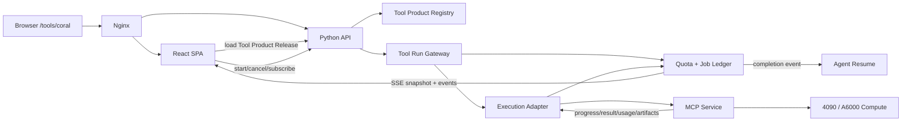
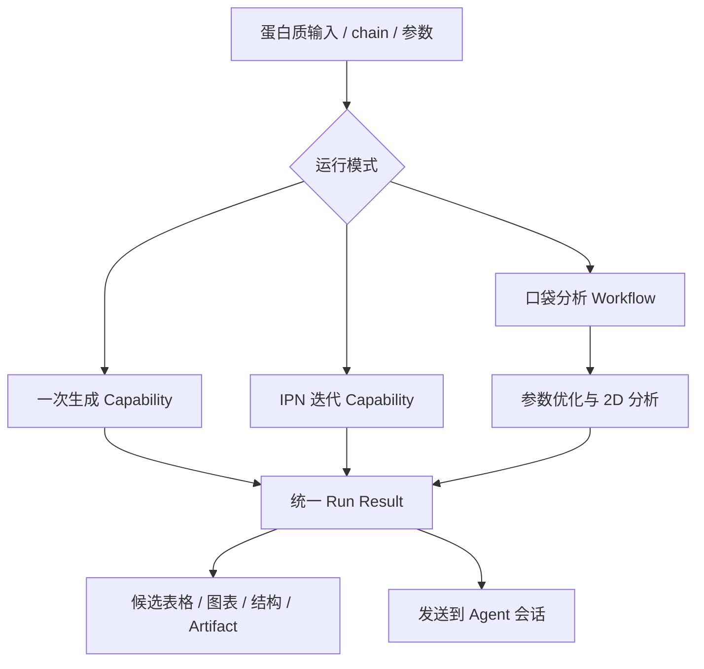

# 配置驱动的 MCP Tool Product 设计

日期：2026-10-06  
状态：待用户审阅  
关联研究：[CORAL MCP 自动接入研究](../../research/2026-10-06-coral-mcp-onboarding.md)

## 1. 背景与目标

PSKit 需要允许同门把科研模型作为 MCP 服务接入。接入者不应为每个新模型提交 React 代码，平台也不应为每个工具新增 Nginx upstream。管理员只提供 MCP 地址、凭据引用、验收案例与声明式页面配置，PSKit 负责发现、验证、发布、计量、渲染和权限控制。

一个产品页面可以组合多个 MCP Capability。CORAL 首个目标页面需要容纳以下逻辑能力，实际工具名在接入时以远端发现结果为准：

1. 一次生成；
2. IPN 迭代生成策略；
3. 蛋白质口袋分析；
4. 基于分析结果的参数优化与 2D 结果展示。

本设计的目标是：

- 输入一个经批准的 MCP 地址后发现工具和协议能力；
- 用可重复执行的测试案例证明服务满足 PSKit 的运行、结果和计量要求；
- 以配置生成完整 Tool 页面，无需接入者提交前端代码；
- 一个页面可以组合多个 Capability 和多阶段工作流；
- 所有任务仍经过 PSKit 的认证、额度、Job、Artifact、审计和 Agent 唤醒链路；
- 页面地址稳定为 `/tools/{slug}`，新增工具不修改 Nginx 配置；
- 发布和回滚同时固定 MCP 绑定、UI 配置、权限及验收证据。

## 2. 非目标

- 不允许运行接入者提交的任意 JavaScript、CSS 或 HTML；
- 不让浏览器持有 MCP 凭据或直接访问模型服务；
- 不把 MCP 自报 GPU 时间描述成经过平台独立核验的硬件账单；
- 不要求所有科研工具具有同一种输入或结果布局；
- 不使用字段名猜测 PDB、序列、GPU 时间等领域语义；
- 不在本轮修改 4090 上的 CORAL 服务或实现产品代码。

## 3. 核心概念

### 3.1 MCP Service

一个可连接的 MCP 服务，负责工具发现与调用。它描述传输协议、endpoint 引用、凭据引用和远端工具 schema，不直接决定公开页面或用户权限。

### 3.2 Capability

PSKit 可调度的版本化计算能力。Capability 描述业务输入、业务结果、必需用量、预算、取消和执行语义。一个 MCP Tool 可以绑定为一个 Capability；同一个 MCP Service 可以暴露多个 Capability。

### 3.3 Tool Product

用户在 `/tools/{slug}` 看到的产品入口。它由一个版本化 UI Schema、一个或多个 Capability 绑定、可见性策略和 Agent 交接规则组成。CORAL 是一个 Tool Product，而一次生成、IPN、口袋分析和 2D 优化分别是它引用的 Capability。

### 3.4 Tool Product Release

不可变发布快照，同时固定：

- Tool Product metadata；
- UI Schema 版本和 digest；
- Capability 精确版本；
- MCP 远端工具绑定和结果提取规则；
- 验收套件与最近一次通过记录；
- 用户/角色可见性和配额策略；
- Agent 交接模板版本。

公开路由只指向一个 Release。回滚切换路由指针，不覆盖历史 Release；运行中的 Job 保留提交时的快照。

## 4. 总体架构



Nginx 只保留稳定入口：

```text
/tools/*  -> React SPA index.html
/api/v1/* -> PSKit Python backend
```

`/tools/coral` 是浏览器路由，不是 CORAL MCP 的反向代理地址。真实 endpoint 由后端 Registry 解析。新增、禁用或回滚 Tool Product 不 reload Nginx。

## 5. 深模块与接口

### 5.1 Tool Product Registry

这是页面发现与发布解析的唯一接口：

```python
resolve(slug, actor) -> PublishedToolProduct
list_visible(actor, cursor) -> ToolProductPage
```

实现内部负责版本指针、权限、Capability 版本和 UI digest。调用方不需要理解管理草稿、MCP endpoint 或数据库表。

### 5.2 MCP Qualification

这是管理端验收远端服务的唯一接口：

```python
discover(service_draft) -> DiscoverySnapshot
qualify(service_revision, suite_revision) -> QualificationReport
```

实现内部负责 MCP 初始化、分页发现、schema 归一化、测试执行、计量检查、Artifact 检查和错误归类。管理页面只展示报告，不自行判断服务是否合格。

### 5.3 Tool Run Gateway

这是 UI 和 Agent 发起工具任务的共同接口：

```python
start(product_release, action_id, input, actor, idempotency_key) -> RunSnapshot
cancel(run_id, actor) -> RunSnapshot
get(run_id, actor) -> RunSnapshot
events(run_id, actor, cursor) -> EventStream
```

实现内部负责输入校验、额度预占、Capability 解析、MCP 调用、Job 持久化、用量结算、Artifact ownership 和 Agent 唤醒。前端不能选择 endpoint 或远端 tool name。

### 5.4 Execution Adapter

运行时保留三个真实 Adapter：

1. `ImmediateMcpAdapter`：一次调用返回终态；
2. `JobMcpAdapter`：submit/status/cancel 工具组合；
3. `McpTasksAdapter`：仅在双方协商支持 MCP Tasks 时使用。

三者向 Tool Run Gateway 返回相同的 PSKit `ExecutionReport`，UI Schema 不感知传输差异。

### 5.5 Tool UI Interpreter

React 中只有一个声明式解释器：

```ts
render(schema: ToolUiSchema, snapshot: ToolRunSnapshot): ReactNode
```

它支持平台白名单组件、数据引用、条件显示、布局和动作。它不执行配置中的 JavaScript，也不拼接远端 URL。

## 6. 三层输出语义

必须区分以下三层，禁止复用一个 `output_schema` 同时表达三种含义：

1. **Remote output**：MCP `structuredContent` 的完整 schema；
2. **Execution report**：PSKit `Completed | Pending | Failed` 统一信封；
3. **Business result**：`Completed.result` 内可供页面和 Agent 消费的科学结果。

绑定配置显式保存：

```yaml
binding:
  capability: coral.generate.one_shot@1.0.0
  adapter: immediate_mcp
  remote_tool: generate_rna_for_protein
  remote_output_schema: {...}
  result_schema: {...}
  result_mapping:
    kind: json_pointer
    pointer: /result
```

`result_mapping` 只允许 JSON Pointer、字段重命名和少量已注册转换器，不支持任意表达式或代码。若远端直接返回业务结果，Adapter 在服务端把它包装成 ExecutionReport；若远端已返回完整 ExecutionReport，则先验证信封，再验证内部 result。

## 7. 统一 ExecutionReport

终态返回保持现有 PSKit 计算契约，示意如下：

```json
{
  "kind": "completed",
  "run_id": "run_123",
  "result": {
    "summary": {
      "candidate_count": 10000,
      "sequence_length": 100
    },
    "candidates": []
  },
  "artifacts": [
    {
      "artifact_id": "artifact_123",
      "kind": "csv",
      "name": "candidates.csv"
    }
  ],
  "usage": {
    "wall_ms": 182400,
    "cpu_core_ms": 91300,
    "gpu_device_ms": 165200,
    "peak_memory_bytes": 4414504960,
    "peak_gpu_memory_bytes": 19545456640,
    "gpu_count": 1,
    "source": "service_reported"
  },
  "provenance": {
    "service_id": "coral",
    "service_version": "1.2.0",
    "model_version": "coral-2026-09"
  }
}
```

规则：

- `result` 必须通过 Capability 的 `result_schema`；
- 大数据通过 owned Artifact 返回，页面预览只读取有界摘要；
- GPU Capability 必须声明 `gpu_device_ms` 是否必需；
- 未知用量为 `null`，已知未使用才为 `0`；
- `source` 至少区分 `measured`、`service_reported`、`estimated`、`unknown`；
- 失败和取消也结算已发生的用量；
- 自报用量可以用于首版额度账本，但界面必须标明来源；需要硬限制时，由受控 worker/gateway 采集 `measured` 数据。

## 8. 异步任务与进度事件

一次生成可以是 immediate 或短时 await；迭代生成和大型分析一般进入持久 Job。浏览器连接与模型执行完全解耦。

Run 事件采用可恢复 cursor：

```text
run.queued
run.started
stage.started
stage.progress
artifact.created
usage.updated
stage.completed
run.completed | run.failed | run.cancelled
```

事件具有 `run_id`、单调递增 `sequence`、时间戳和幂等事件 ID。页面刷新后先获取 snapshot，再从 cursor 继续订阅。前端流程节点只能由真实事件点亮，不生成虚构百分比或阶段。

多 Capability 工作流不在 UI 中执行。UI 的一个 action 可以绑定：

- 单个 Capability；或
- 后端注册的 Workflow Definition。

Workflow Definition 固定节点、输入映射、依赖和失败策略。每个节点仍生成独立 Step/Attempt/usage，最终 Run 汇总结果和用量。

## 9. Tool UI Schema

### 9.1 原则

- JSON/YAML 只是同一个版本化 schema 的两种作者格式；数据库保存规范化 JSON；
- UI Schema 引用 Capability 的业务 schema，不复制模型服务地址；
- 组件来自平台白名单；未知组件导致验收失败；
- 数据引用使用受限引用语法，不执行代码；
- 配置有独立 schema 版本、digest 和大小上限；
- 中英文案使用显式 locale map，不把机器翻译写进运行时；
- 主题、焦点、移动端、加载、空、失败状态由平台组件保证。

### 9.2 顶层结构

```yaml
schema_version: pskit.tool-ui.v1
product:
  slug: coral
  title:
    zh-CN: CORAL RNA 设计
    en: CORAL RNA Design
  description:
    zh-CN: 从蛋白质目标生成并分析 RNA 候选
    en: Generate and analyze RNA candidates from a protein target

page:
  layout: split-workspace
  input_width: 5
  result_width: 7

state:
  mode:
    initial: one_shot

sections: []
actions: []
result_views: []
handoffs: []
```

### 9.3 白名单输入组件

首版至少包括：

- `text-input`、`number-input`、`textarea`；
- `select`、`segmented-control`、`checkbox`、`switch`；
- `file-upload`、`protein-input`、`sequence-input`；
- `parameter-group`、`advanced-section`；
- 由 JSON Schema 约束驱动的默认值、枚举、范围、必填和帮助信息。

文件字段保存 owned file ID，不把浏览器路径或文件正文写进参数。

### 9.4 白名单结果组件

首版至少包括：

- `metric-grid`；
- `stage-flow`；
- `sequence-table`；
- `data-table`；
- `line-chart`、`scatter-plot`、`heatmap`；
- `structure-viewer`；
- `artifact-list`；
- `json-inspector` 作为受限兜底。

每个组件声明 `source`、空状态和展示上限：

```yaml
- id: candidates
  component: sequence-table
  source: /run/result/candidates
  preview_limit: 100
  full_data_artifact: /run/artifacts/candidates_csv
```

数据引用使用 JSON Pointer。列表排序、截断、数值格式化等使用命名内置转换器；配置不能使用 `eval`、模板脚本或网络请求。

### 9.5 条件与动作

条件只支持白名单谓词：`equals`、`in`、`exists`、`and`、`or`、`not`。

```yaml
visible_when:
  source: /form/mode
  equals: iterative
```

动作只能引用发布单元中存在的 action：

```yaml
- id: run
  label:
    zh-CN: 运行 CORAL
    en: Run CORAL
  kind: start_run
  target:
    by_state:
      source: /form/mode
      map:
        one_shot: coral-one-shot
        iterative: coral-iterative
        pocket: coral-pocket-analysis
```

前端把 action ID 和表单数据提交给 Tool Run Gateway；Capability、endpoint 和远端工具名由后端发布快照解析。

## 10. CORAL 页面设计



桌面端左侧为目标和参数，右侧为真实进度与结果；移动端为单列。页面顶部用模式选择器切换三条入口，但所有模式共享当前蛋白质输入。迭代模式显示迭代预算和策略参数，口袋分析模式显示分析参数及后续优化选项。

结果区由实际模式决定：

- 一次/迭代生成：候选数量、长度、评分摘要、序列表格和完整数据 Artifact；
- 口袋分析：口袋摘要、残基/位置数据、结构预览和分析 Artifact；
- 2D 优化：参数变化、目标函数曲线、二维图和最终推荐参数；
- 全部模式：实际用量、模型/服务版本、运行历史、取消/重试状态和 Agent 交接。

“交给 Agent 分析”只提交 `run_id`、有界摘要和 Artifact 引用，不把一万条序列塞进提示词。新 Session 获得不可变任务上下文，Agent 通过 owned API 读取完整结果。

## 11. 管理端接入与审核

### 11.1 状态机

```text
draft
  -> discovered
  -> configured
  -> qualifying
  -> qualified
  -> review_pending
  -> published

任一步失败 -> needs_changes
published -> suspended | superseded
```

`qualified` 表示当前服务 revision、Capability binding、UI Schema 和 acceptance suite 的组合通过；其中任一 digest 改变都回到 `configured`。管理员人工批准后才成为 `published`。

### 11.2 管理页面流程

1. **连接**：填写 MCP endpoint、transport、凭据引用和网络区域；
2. **发现**：显示完整 `tools/list`、schema、协议能力和 digest；
3. **映射**：选择工具，定义 Capability、执行 Adapter、业务 result 和 required usage；
4. **组合产品**：创建 Tool Product，使用可视化 UI Builder 选择模板、字段、结果组件与数据来源；
5. **案例**：添加公开测试输入、私密 Fixture 引用、结果断言与资源断言；
6. **运行验收**：保存每个案例的 Run、日志、Artifact、usage 和断言结果；
7. **预览**：通过仅管理员可见的 preview release 打开真实配置页面；
8. **审核发布**：展示 diff、风险、测试证据、计量来源和可见人群；
9. **暂停/回滚**：停止新提交或切回上一 Release，不篡改历史 Job。

### 11.3 验收维度

发布门槛至少包括：

| 维度 | 验收内容 |
| --- | --- |
| 协议 | initialize、分页发现、工具 schema、超时、错误分类 |
| 输入 | 合法案例成功；必填、范围、文件类型等非法案例被拒绝 |
| 生命周期 | immediate 或 submit/status/cancel 与声明一致；幂等键不重复执行 |
| 结果 | ExecutionReport 与 business result schema 都通过 |
| Artifact | ownership、大小、类型、下载和缺失处理正确 |
| 计量 | required usage 齐全、非负、单位正确、source 明确 |
| 进度 | stage 事件有序、可恢复，不虚构完成状态 |
| UI | 所有 source 存在、组件支持该数据形状、双语及空/错状态完整 |
| 安全 | endpoint 受批准、凭据不返回浏览器、无外部 schema 引用或任意代码 |
| 科学案例 | 维护者提供的基准输入满足结构、范围或已知结果断言 |

协议验收和科学验收分开显示。平台可以证明协议合规，科学正确性需要服务责任人和审核者签署对应证据。

## 12. 配置发现与零代码接入

首版允许三种 UI 配置来源，最终都进入相同草稿和审核流程：

1. 管理员使用 UI Builder 生成；
2. 粘贴或上传符合 `pskit.tool-ui.v1` 的 YAML/JSON；
3. 服务可选提供 PSKit manifest，管理端导入为草稿。

可选 manifest 只减少录入工作，不自动发布，也不被当作可信配置。建议后续约定 `/.well-known/pskit-tool-product.json` 或 MCP Resource 的稳定 URI；导入后仍需要 endpoint 策略、验收案例和人工批准。

所谓“一键部署”分两层：

- **模型服务部署**：同门自己运行 MCP，或以后由平台按受控部署模板创建；
- **PSKit 产品发布**：输入 URI、发现、导入配置、执行案例、管理员批准。

两者不能因按钮相同而共用凭据或安全域。

## 13. API 草案

### 13.1 用户接口

```text
GET    /api/v1/tool-products
GET    /api/v1/tool-products/{slug}
POST   /api/v1/tool-products/{slug}/actions/{action_id}/runs
GET    /api/v1/tool-runs/{run_id}
GET    /api/v1/tool-runs/{run_id}/events?cursor=...
POST   /api/v1/tool-runs/{run_id}/cancel
GET    /api/v1/tool-products/{slug}/runs
POST   /api/v1/tool-runs/{run_id}/agent-handoffs/{handoff_id}
```

所有接口从 JWT 解析用户，后端重新检查 Release 可见性、Capability 权限和余额。前端发送的 product/capability metadata 不作为授权事实。

### 13.2 管理接口

```text
POST   /api/v1/admin/mcp-probes
GET    /api/v1/admin/mcp-probes/{probe_id}
POST   /api/v1/admin/services/{service_id}/discoveries
PUT    /api/v1/admin/services/{service_id}/bindings
PUT    /api/v1/admin/tool-products/{product_id}/draft
POST   /api/v1/admin/tool-products/{product_id}/qualifications
GET    /api/v1/admin/qualifications/{qualification_id}
POST   /api/v1/admin/tool-products/{product_id}/preview-releases
POST   /api/v1/admin/tool-product-releases/{release_id}/publish
POST   /api/v1/admin/tool-product-releases/{release_id}/suspend
```

探测任意 URI 是 SSRF 高风险操作。公网提交者只能选择已登记 endpoint；只有受限管理员流程能创建 probe，且执行器必须阻止 loopback、link-local、云 metadata、非批准私网和重定向逃逸。生产凭据只存 secret reference。

## 14. 数据模型草案

```text
mcp_services
mcp_service_revisions
mcp_discovery_snapshots
capability_bindings

tool_products
tool_product_revisions
tool_product_releases
tool_product_release_capabilities

acceptance_suites
acceptance_cases
qualification_runs
qualification_case_results
review_decisions

tool_runs
tool_run_steps
tool_run_events
tool_run_artifacts
tool_run_usage
```

草稿可修改，Release、Qualification Report、Review Decision 和 Job snapshot 不可变。发现 snapshot 保存原始受限响应、归一化结果和 digest，以便证明管理员审核的具体版本。

## 15. 错误处理

错误分为稳定机器码和本地化展示：

- `MCP_DISCOVERY_FAILED`
- `MCP_SCHEMA_CHANGED`
- `TOOL_PRODUCT_NOT_AVAILABLE`
- `TOOL_ACTION_NOT_AVAILABLE`
- `TOOL_INPUT_INVALID`
- `TOOL_QUOTA_EXCEEDED`
- `TOOL_RESULT_INVALID`
- `TOOL_USAGE_INCOMPLETE`
- `TOOL_RUN_OUTCOME_UNKNOWN`
- `TOOL_RUN_CANCEL_PENDING`
- `TOOL_UI_BINDING_INVALID`

结果未知时禁止盲目重试；先按 idempotency key 或远端 job ID 恢复。取消仅表示已请求，直到远端确认前不能释放预占或声称 GPU 已停止。

## 16. 测试与验收策略

后续实施采用契约优先的 TDD：

1. 用 JSON Schema fixtures 验证 Tool UI Schema 和引用；
2. 用 fake MCP 验证 immediate、job、MCP Tasks 三种 Adapter；
3. 用隔离 PostgreSQL 验证发布原子性、版本快照、幂等、事件恢复和额度结算；
4. 用 React 交互测试验证配置可生成输入、进度、结果、历史和错误状态；
5. 用一个合成多 Capability 服务验证无需新增前端代码即可发布新 `/tools/{slug}` 页面；
6. 用 CORAL 的代表性案例做真实 4090 联调，并单独记录 GPU 计量来源和科学结果证据。

最关键的产品验收是：在不修改 React、Nginx 和公开 Python route 的前提下，管理员仅通过 MCP endpoint、绑定、UI Schema 和案例发布一个新的多 Capability Tool Product。

## 17. 迁移路径

1. 保留现有 `GenericToolPage` 和硬编码 CORAL 页面作为兼容入口；
2. 先实现 Tool Product Release 与只读解释器，使用 mock/fake 配置渲染；
3. 将通用 MCP 工具迁入 Tool Product Registry；
4. 加入 qualification、preview 和原子发布；
5. 将 CORAL 四类能力接入统一 Job/usage/artifact 协议；
6. 用配置生成的 CORAL 页面替换硬编码分支；
7. 迁移完成后删除旧的按工具名分支与重复表单逻辑。

迁移遵循替换而非叠加：新解释器成为唯一页面渲染入口后，旧工具专用路由不再作为第二套长期架构保留。

## 18. 设计结论

PSKit 不把接入者的前端代码带进主应用，也不把 Nginx 变成动态业务注册表。平台提供一个受控但足够丰富的 UI DSL，让配置决定页面；所有动作通过 Tool Run Gateway 进入统一 Job、额度、计量、Artifact 和 Agent 运行时。

一个 MCP 地址可以提供多个工具，一个 Tool Product 可以组合多个 Capability。MCP 负责工具互操作，ExecutionReport 负责可靠计算，Tool UI Schema 负责展示，Tool Product Release 把三者与验收证据原子绑定。这是新科研服务无需新增代码即可进入 PSKit 的稳定接口。
